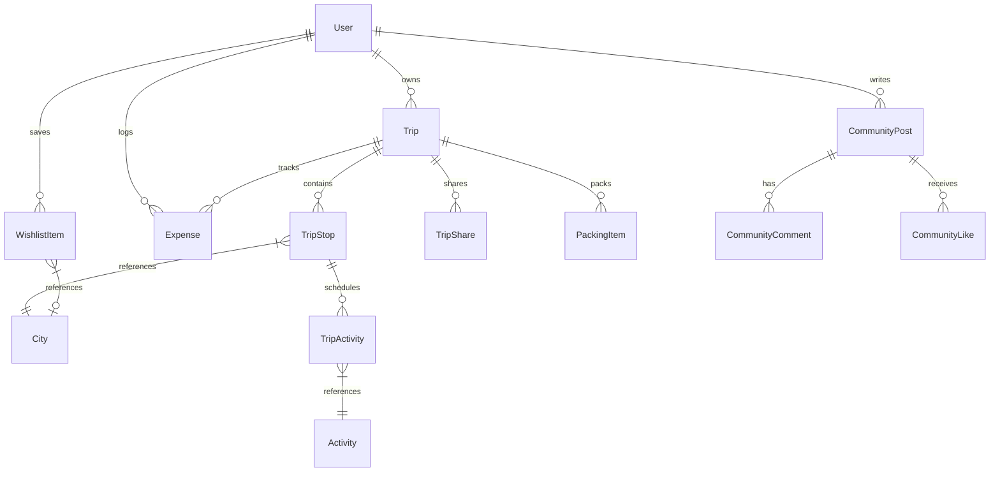

# 🌍 GlobeTrotter — Next-Gen Multi-City Travel Operating System

<div align="center">


**A high-performance travel itinerary architect designed for modern travelers exploring multiple destinations.**  
Plan day-by-day journeys across cities, convert expenses live with 30+ world currencies, visualize flight routes on interactive maps, curate dream bucket lists, and export executive PDF dossiers with a single click.

[Features](#-key-features) • [Tech Stack](#-tech-stack) • [Quick Start](#-quick-start) • [Database Architecture](#-database-schema--architecture) • [API Directory](#-api-routes) • [Screenshots](#-preview--ui-highlights)

</div>

---

## 🌟 Key Features

### 🗺️ 1. Interactive Multi-City Route Maps
- **Interactive Geospatial Visualization:** Auto-plots all stops along your journey on high-resolution Leaflet maps.
- **Numbered Journey Pins & Flight Arcs:** Displays sequence markers with curved flight path polylines connecting each destination.
- **Live Weather Telemetry:** Real-time temperature and meteorological conditions fetched via the Open-Meteo API.
- **Custom Map Themes:** 1-click toggling between **CartoDB Voyager (Default)**, **Satellite Imagery**, and **Minimalist Positron**.

### 💱 2. Multi-Currency Financial Engine
- **30+ Global Currencies:** Built-in rate engine supporting `USD`, `EUR`, `GBP`, `JPY`, `INR`, `CAD`, `AUD`, `CHF`, `AED`, `SGD`, `THB`, and more.
- **Automatic Expense Normalization:** Input foreign expenses in local city currency (e.g., Yen in Tokyo, Euros in Rome) while the dashboard automatically converts and tracks against your trip base budget.
- **Category Spend Analytics:** Visual pie and bar breakdowns for Lodging, Flights, Dining, Transit, and Activities.

### 📄 3. 1-Click Day 1 to End Day PDF & Markdown Dossier
- **Executive Travel Briefing:** Generates an exhaustive day-by-day timetable including activity schedules, sight locations, estimated costs, and emergency contacts.
- **Pristine Print Engine:** Custom `@media print` layout isolation with `print-avoid-break` guarantees that maps, web navigation bars, and buttons are hidden, printing only the polished itinerary report.
- **Multi-Format Export:** 1-click **Save as PDF** (`window.print()`), **Download Markdown (`.md`)**, or **Copy to Clipboard**.

### ❤️ 4. Travel Wishlist & 1-Click Trip Builder
- **Visual Bucket List Hub:** Save dream destinations, bucket-list activities, luxury stays, and culinary spots.
- **Priority & Season Filters:** Filter by priority tier (`★★★ Top Priority`), travel season (Spring, Summer, Autumn, Winter), and categories.
- **1-Click Conversion:** Turn any saved wish into a full multi-city trip itinerary in one click.
- **Public Wishlist Sharing:** Share view-only links to friends and family with built-in WhatsApp, X, and Facebook sharing shortcuts.

### 📅 5. Horizon Travel Calendar
- **Interactive Monthly Grid:** Color-coded multi-day span bars showing all upcoming trips and multi-city stops.
- **Timeline Inspection:** Click any calendar day to inspect scheduled activities, times, and destinations.

### 👥 6. Collaboration & Social Community
- **Shared Itineraries:** Invite travel buddies with configurable `Editor` or `Viewer` permissions.
- **Community Travel Stories:** Discover itineraries shared by fellow globetrotters, like posts, leave comments, and clone trips directly to your account.
- **Packing List Assistant:** Categorized checklist (Clothing, Electronics, Documents, Essentials) with real-time completion tracking.

---

## 🛠️ Tech Stack

| Layer | Technologies |
|---|---|
| **Frontend Framework** | [Next.js 15](https://nextjs.org/) (App Router, React Server Components) |
| **Language** | [TypeScript 5](https://www.typescriptlang.org/) |
| **Styling & Design** | [Tailwind CSS](https://tailwindcss.com/), Framer Motion, Lucide Icons |
| **Database** | [Neon Serverless PostgreSQL](https://neon.tech/) |
| **ORM** | [Prisma ORM 5.22](https://www.prisma.io/) |
| **Authentication** | [NextAuth.js](https://next-auth.js.org/) with BCrypt Password Hashing & JWT Sessions |
| **Maps & GIS** | [Leaflet](https://leafletjs.com/), [React-Leaflet](https://react-leaflet.js.org/) |
| **Notifications** | [React Hot Toast](https://react-hot-toast.com/) |

---

## 🚀 Quick Start

### Prerequisites
- [Node.js](https://nodejs.org/) (v18.17.0 or newer)
- [npm](https://www.npmjs.com/) or [pnpm](https://pnpm.io/)
- A PostgreSQL Database (e.g. [Neon.tech](https://neon.tech), Supabase, or Local Postgres)

### 1. Clone the Repository
```bash
git clone https://github.com/Parmarprashant/GlobeTrotter.git
cd GlobeTrotter
```

### 2. Install Dependencies
```bash
npm install
```

### 3. Configure Environment Variables
Create a `.env` file in the root directory and add the following configuration:

```env
# PostgreSQL Database Connection (Neon Serverless or Local)
DATABASE_URL="postgresql://<user>:<password>@<host>/<dbname>?sslmode=require&connect_timeout=30&pool_timeout=30&connection_limit=10"

# NextAuth Configuration
NEXTAUTH_SECRET="your-secure-random-32-byte-secret"
NEXTAUTH_URL="http://localhost:3000"

# (Optional) Admin Access - comma separated email addresses
NEXT_PUBLIC_ADMIN_EMAILS="admin@globetrotter.com"

# (Optional) External Travel APIs
# OPENTRIPMAP_API_KEY="your-opentripmap-api-key"
# RAPIDAPI_KEY="your-rapidapi-key"
```

> **Tip:** Generate a secure `NEXTAUTH_SECRET` with:
> ```bash
> openssl rand -base64 32
> ```

### 4. Setup Database & Seed Catalog
Push the Prisma schema to your PostgreSQL database and seed the destination catalog:
```bash
# Push database schema
npx prisma db push

# (Optional) Seed 100+ worldwide cities & activities
npm run seed
```

### 5. Start the Development Server
```bash
npm run dev
```
Open [http://localhost:3000](http://localhost:3000) in your browser to view GlobeTrotter!

---

## 📂 Project Architecture

```
GlobeTrotter/
├── prisma/
│   ├── schema.prisma              # PostgreSQL schema definitions & models
│   └── seed.ts                    # Database seeder for cities, activities & demo trips
├── src/
│   ├── app/
│   │   ├── (app)/                 # Authenticated Application Routes
│   │   │   ├── admin/             # System admin portal & catalog manager
│   │   │   ├── calendar/          # Monthly & day travel calendar
│   │   │   ├── community/         # Social travel stories & post feed
│   │   │   ├── dashboard/         # Traveler dashboard & financial telemetry
│   │   │   ├── explore/           # Destination discovery (cities & activities)
│   │   │   ├── profile/           # User settings, bio & base currency
│   │   │   ├── trips/             # My Trips, Trip Builder & Itinerary Planner
│   │   │   └── wishlist/          # Travel Wishlist & Bucket List Hub
│   │   ├── (auth)/                # Login, Signup, Forgot Password
│   │   ├── api/                   # RESTful API Endpoints
│   │   │   ├── auth/              # NextAuth route handlers & signup
│   │   │   ├── cities/            # City catalog & live discovery
│   │   │   ├── community/         # Post creations, comments, and likes
│   │   │   ├── dashboard/         # Aggregated travel telemetry
│   │   │   ├── trips/             # Trip CRUD, Stops, Activities, Budget & Sharing
│   │   │   └── wishlist/          # Wishlist items & public share generation
│   │   ├── public/                # Public read-only share routes
│   │   │   ├── trips/[slug]/      # Public shared itinerary view
│   │   │   └── wishlist/[token]/  # Public shared bucket list view
│   │   ├── globals.css            # Global CSS tokens & @media print styles
│   │   ├── layout.tsx             # Root HTML layout with providers
│   │   └── page.tsx               # High-impact landing page & Bento Showcase
│   ├── components/
│   │   ├── itinerary/             # Map, Stops, Timelines & Export Dossier Modal
│   │   ├── ui/                    # Modals, Buttons, Badges, EmptyStates, Skeletons
│   │   ├── CityCard.tsx           # Destination cards with live weather
│   │   ├── ActivityCard.tsx       # Experience cards with tags & duration
│   │   ├── Footer.tsx             # Global luxury dark footer
│   │   └── TripCard.tsx           # Trip overview cards with live budget
│   ├── lib/
│   │   ├── api-client.ts          # Strongly typed client API SDK
│   │   ├── currency.ts            # 30+ currency rate mappings & conversions
│   │   ├── format.ts              # Financial, date & time formatters
│   │   ├── prisma.ts              # Global Prisma client singleton
│   │   └── rate-limit.ts          # In-memory sliding window rate limiter
│   └── middleware.ts              # Auth protection, CORS & rate limit enforcement
```

---

## 🗄️ Database Schema & Architecture



### Core Models
- **`User`**: Account identity, personal currency base, avatar, and credentials.
- **`Trip`**: Container for journey duration, total budget, base currency, and share tokens.
- **`TripStop`**: Multi-city stopover sequencing with arrival/departure dates.
- **`TripActivity`**: Timetabled activity slot linked to a stop with scheduled hours and actual spend.
- **`Expense`**: Individual financial ledger item categorised into Lodging, Flights, Dining, Transit, etc.
- **`WishlistItem`**: Curated bucket list target with priority stars, estimated cost, and category.
- **`City` & `Activity`**: Pre-seeded global destination catalog with coordinates and popularity scores.

---

## 🌐 API Routes

| Endpoint | Methods | Description |
|---|---|---|
| `/api/auth/[...nextauth]` | `GET`, `POST` | NextAuth authentication handlers & session queries |
| `/api/auth/signup` | `POST` | User registration with BCrypt password hashing |
| `/api/trips` | `GET`, `POST` | List user trips or initialize a new journey |
| `/api/trips/[id]` | `GET`, `PATCH`, `DELETE` | Full trip details, metadata updates, or deletion |
| `/api/trips/[id]/stops` | `POST`, `PUT` | Add destination stops or reorder route sequence |
| `/api/trips/[id]/activities` | `POST`, `PATCH`, `DELETE` | Add, reschedule, or remove itinerary activities |
| `/api/trips/[id]/budget` | `GET`, `POST` | Financial overview and expense logging |
| `/api/trips/[id]/share` | `GET`, `POST`, `DELETE` | Manage collaborator permissions and public tokens |
| `/api/wishlist` | `GET`, `POST` | Retrieve and add bucket list items |
| `/api/wishlist/[id]` | `PATCH`, `DELETE` | Update priority or remove saved wish |
| `/api/wishlist/share` | `POST` | Generate public share token for bucket list |
| `/api/cities` | `GET` | Search global city database with popularity filters |
| `/api/community/posts` | `GET`, `POST` | Community travel feed, story posts, and likes |

---

## 📦 Available Scripts

| Command | Action |
|---|---|
| `npm run dev` | Starts the Next.js local development server on `http://localhost:3000` |
| `npm run build` | Compiles the production build bundle |
| `npm run start` | Launches the production server |
| `npm run lint` | Runs Next.js ESLint verification |
| `npx prisma db push` | Pushes Prisma schema updates directly to the database |
| `npx prisma studio` | Opens Prisma Studio GUI on `http://localhost:5555` to browse tables |

---

## 🔒 Security & Best Practices
- **Password Security:** Salted BCrypt password hashing (`bcryptjs`).
- **Session Management:** Secure HTTP-only JWT session tokens via NextAuth.
- **Rate Limiting:** Sliding-window IP rate limiting on API endpoints to prevent brute-force attacks.
- **SQL Injection Prevention:** 100% parameterized queries via Prisma ORM.
- **Security Headers:** Enforced `nosniff`, `DENY` framing, and strict referrer policies.

---

## 📄 License
This project is licensed under the **MIT License** — feel free to use, modify, and distribute for personal or commercial projects.

---

<div align="center">

Crafted with ❤️ for modern globetrotters who explore more than one city.

**[Explore GlobeTrotter Live](http://localhost:3000)**

</div>
